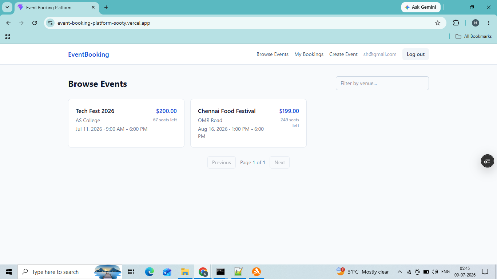
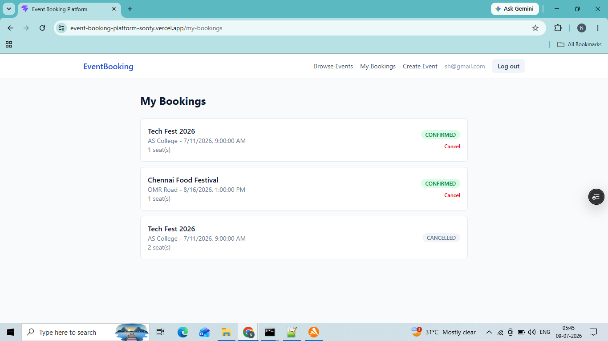
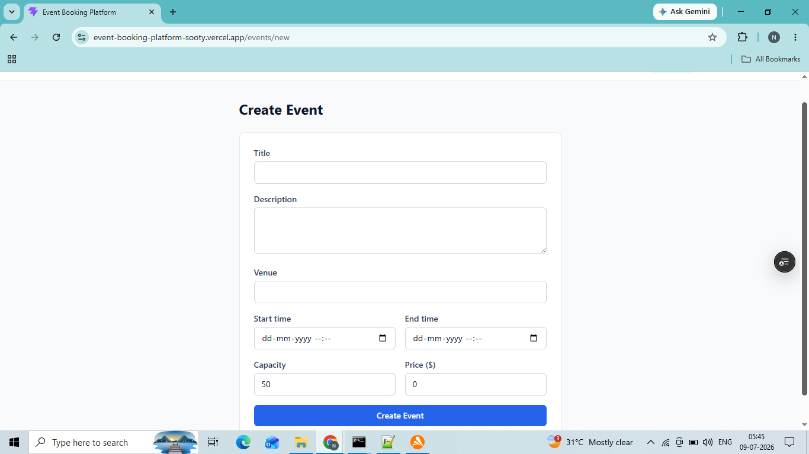
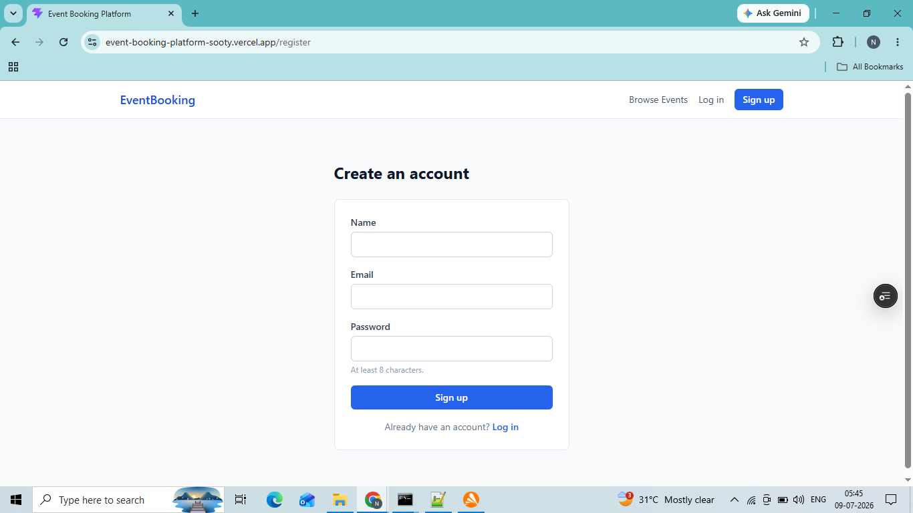

# Event Booking Platform

A full-stack event booking platform where organizers can create events and attendees can browse, book, and manage seats — built as a capstone project covering a production-style Node.js/React stack, automated testing, Docker, CI/CD, and live cloud deployment.

**Live app:** https://event-booking-platform-sooty.vercel.app
**Live API health check:** https://event-booking-platform-czxv.onrender.com/health
**Interactive API docs (Swagger):** https://event-booking-platform-czxv.onrender.com/api-docs


> **Note on Render's free tier:** the backend spins down after 15 minutes of inactivity and can take 30-60 seconds to wake up on the first request after idling. An uptime monitor pings it every 5 minutes to keep it warm, but if you're the very first visitor after a quiet period, please allow a moment for the first request to complete.

---

## Screenshots

| Browse Events | My Bookings |
|---|---|
|  |  |

| Create Event | Sign Up |
|---|---|
|  |  |

---

## What it does

- Browse events with pagination and venue filtering
- Register / log in (JWT access + refresh token auth)
- Create and manage your own events
- Book seats on an event, with real-time capacity enforcement (no overbooking, even under concurrent requests)
- View and cancel your own bookings
- Stay logged in across page refreshes via a silent token refresh

---

## Tech stack

| Layer | Technology |
|---|---|
| Frontend | React 18, Vite, TypeScript, TailwindCSS v4, TanStack Query, Zustand, react-router-dom |
| Backend | Node.js 20, Express, TypeScript |
| Database | PostgreSQL, Prisma ORM |
| Auth | JWT (access + httpOnly-cookie refresh tokens), bcryptjs |
| Testing | Jest, Supertest (41 tests: unit + integration) |
| Containerization | Docker, Docker Compose |
| CI | GitHub Actions (lint → migrate → build → test, on every push/PR to `main`) |
| Hosting | Backend + DB on Render, Frontend on Vercel (both auto-deploy from `main`) |
| Monitoring | UptimeRobot polling `/health` every 5 minutes |

---

## Architecture

```
                      HTTPS                              TCP
  ┌───────────────┐  ────────►  ┌──────────────────┐  ────────►  ┌──────────────┐
  │   React SPA    │             │  Node.js/Express  │             │  PostgreSQL  │
  │   (Vercel)     │  ◄────────  │   REST API         │  ◄────────  │  (Render)    │
  │                │    JSON      │   (Render)         │              │              │
  └───────────────┘              └──────────────────┘              └──────────────┘
                                          ▲
                                          │
                                ┌─────────┴──────────┐
                                │   GitHub Actions    │
                                │  lint → test → build │
                                │  (gates every push)  │
                                └──────────────────────┘
```

The frontend and backend are deployed independently and communicate over HTTPS via `VITE_API_URL`. GitHub Actions acts as the CI gate (lint/test/build must pass); Render and Vercel are each connected directly to the GitHub repo and auto-deploy their respective folders on every push to `main` that reaches them.

---

## Repository structure

```
capstone-project/
├── .github/workflows/       # CI pipelines (backend-ci.yml, frontend-ci.yml)
├── backend/
│   ├── src/                 # routes → controllers → services → Prisma
│   ├── tests/                # unit + integration tests
│   ├── prisma/                # schema + migrations + seed script
│   └── Dockerfile
├── frontend/
│   ├── src/                  # pages, components, hooks, api client, store
│   ├── vercel.json            # SPA routing rewrite rule
│   └── Dockerfile
└── docker-compose.yml         # brings up db + backend + frontend together
```

---

## Running it locally

### Option A — Docker Compose (recommended, matches production)

```bash
git clone https://github.com/nithya-hash/Event-Booking-Platform.git
cd Event-Booking-Platform

cp backend/.env.example backend/.env
cp frontend/.env.example frontend/.env
# edit backend/.env: fill in JWT_ACCESS_SECRET / JWT_REFRESH_SECRET
# (generate each with: node -e "console.log(require('crypto').randomBytes(32).toString('base64'))")

docker compose up --build
```

- Frontend: http://localhost:3000
- Backend: http://localhost:4000
- API docs: http://localhost:4000/api-docs

### Option B — Run backend and frontend natively

```bash
# Backend
cd backend
npm install
cp .env.example .env   # fill in DATABASE_URL + JWT secrets
npx prisma generate
npx prisma migrate dev
npx prisma db seed      # optional demo data
npm run dev              # http://localhost:4000

# Frontend (separate terminal)
cd frontend
npm install
cp .env.example .env
npm run dev               # http://localhost:3000
```

Requires a running PostgreSQL instance for Option B (Docker Compose handles this for you in Option A).

---

## API reference

Full interactive documentation (request/response schemas, "try it out" support) is generated from the code and available at `/api-docs` on the backend — locally at http://localhost:4000/api-docs, or live at the link at the top of this README.

Quick summary:

| Method | Endpoint | Auth | Description |
|---|---|---|---|
| POST | `/api/v1/auth/register` | – | Create an account |
| POST | `/api/v1/auth/login` | – | Log in |
| POST | `/api/v1/auth/refresh` | cookie | Exchange refresh cookie for new access token |
| POST | `/api/v1/auth/logout` | – | Clear refresh cookie |
| GET | `/api/v1/events` | – | List events (paginated, filterable by venue) |
| GET | `/api/v1/events/:id` | – | Get one event (includes computed `availableSeats`) |
| POST | `/api/v1/events` | ✅ | Create an event |
| PATCH | `/api/v1/events/:id` | ✅ owner/admin | Update an event |
| DELETE | `/api/v1/events/:id` | ✅ owner/admin | Delete an event |
| POST | `/api/v1/bookings` | ✅ | Book seats on an event |
| GET | `/api/v1/bookings/me` | ✅ | List your own bookings |
| PATCH | `/api/v1/bookings/:id/cancel` | ✅ owner/admin | Cancel a booking |
| GET | `/health` | – | Health check (used by monitoring + container orchestration) |

---

## Testing

```bash
cd backend
npx jest tests/unit    # 16 tests, no DB needed
npm test                 # all 41 tests (needs a running Postgres - Jest runs suites serially since integration tests share one DB)
```

Coverage: JWT signing/verification, Zod validation schemas, full auth flow (register/login/refresh), event CRUD with ownership rules, and booking capacity enforcement (including the overbooking-prevention transaction).

---

## CI/CD

On every push or PR to `main`, GitHub Actions runs (separately for `backend/` and `frontend/` via path filters):

1. **Lint** — ESLint (backend) / oxlint (frontend)
2. **Migrate** — applies Prisma migrations against an ephemeral Postgres service container (backend only)
3. **Build** — TypeScript compilation
4. **Test** — full Jest suite against the ephemeral database (backend only)

Deployment itself is handled by Render and Vercel, both connected directly to this repo — they rebuild and redeploy automatically on every push to `main` that reaches them, independent of the GitHub Actions run. The backend also runs `prisma migrate deploy` automatically on every container startup, so schema changes land in production without a manual step.

---

## Known limitations & future work

- **No seat-level selection** — bookings reserve a quantity of seats against an event's total capacity, not specific named seats.
- **No payment integration** — `price` is stored and displayed but checkout is not implemented (out of scope for this capstone).
- **No refresh-token revocation list** — logout clears the cookie client-side; a compromised refresh token remains valid until it expires (7 days) rather than being server-side invalidated.
- **No admin UI** — the `Role` field (`USER`/`ADMIN`) exists in the schema and is enforced on the backend (admins can edit/delete any event or booking), but there's no dedicated admin dashboard in the frontend yet.
- **Render free-tier cold starts** — see the note at the top of this README.

Possible future work: seat-map selection, real payment provider integration, email notifications on booking/cancellation, an admin dashboard, and waitlists for sold-out events.

---

## Demo credentials

If the live database has been seeded (`npx prisma db seed`), these accounts are available:

| Role | Email | Password |
|---|---|---|
| Admin | admin@demo.com | Password123! |
| Attendee | user@demo.com | Password123! |

Otherwise, use the **Sign up** page to create your own account — registration is open to anyone.